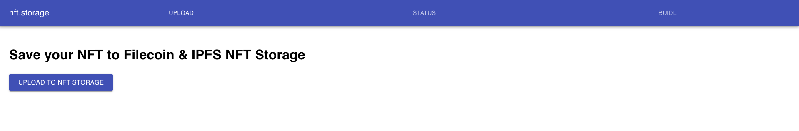
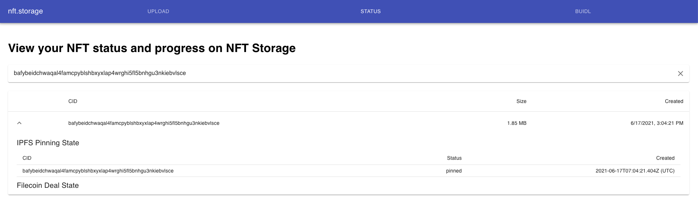

# NFT.Storage

NFT.Storage is an application frontend of the community project: [shipyard/nft.storage](https://github.com/ipfs-shipyard/nft.storage)

## Usage

Displays steps to use the NFT.Storage application.

### Uploading NFTs

Upload your NFTs by clicking `Upload to nft storage`:

Select one or more NFTs, then click submit:

After submitted, a CID with an IPFS gateway link will be printed:

### Inspect uploaded NFTs

Navigate to the printed CID gateway link, if it's a folder it will display as a tree:

And to view a NFT inside a CID folder:

### Get the uploaded NFT status

Navigate to status tab of NFT.Storage, and input any CID representing a NFT:

If a CID exists in nft.storage, then the status and information of the CID will be displayed as table:

A NFT needs time to be minted, so there is only the IPFS pinning state of new uploaded NFT at this time.

If a CID does not exists in nft.storage, an error message alerting the NFT status will be prompted:

## File type supports

A listed file type that NFT.Storage can upload:

- PDF
- Any images (png, jpeg, gif, etc.)
- Any videos (mp4, mov, flv, etc.)
- Any audios (mp3, aac, wav, etc.)

## File limits

Current file limits is per 100MB a file, as same as [nft.storage](https://nft.storage/).

## What is different

In this stage, nothing different but multiple files uploading to [nft.storage](https://nft.storage/). In the future, we will add support to display NFT market that with nft stored in [nft.storage](https://nft.storage/) and support the newest functionalities of the [SDK](https://github.com/ipfs-shipyard/nft.storage/tree/main/packages/client).
